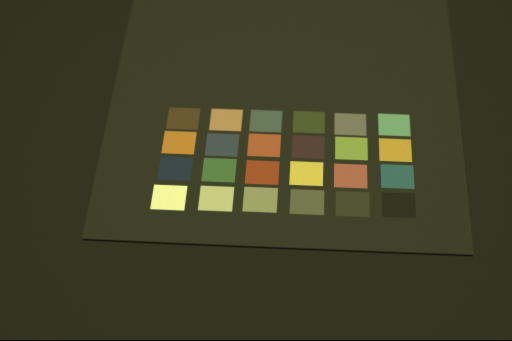
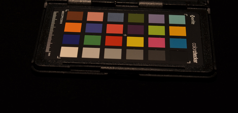
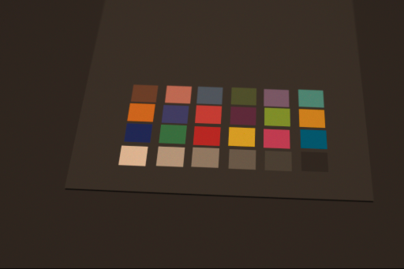

# Introduction
This project aims to quickly and easily generate and apply a 3x3 color correction matrix (CCM) using processed or raw images.

## Contents
This repository contains three related tools:
- **extractColor**: Find and extract color values from a raw or processed image containing a 24-chip ColorChecker grid
- **computeCCM**: Given two sets of color values, compute the color correction matrix (CCM) to convert from one to the other in XYZ color space.
- **correctColor**: Apply a CCM and other corrections to a raw or processed image.

Each tool is described in detail below.

## Dependencies
Version numbers only reflect the versions used for development, other versions may work too. Developed on Linux Mint 18.3 Sylvia.
- OpenCV 3.4
- Python 3.5
    - exifread 2.1
    - numpy 1.14
    - opencv-python 3.4
    - rawpy 0.12

## Disclaimer
This is a heavily-modifed fork of [lighttransport/colorcorrectionmatrix](https://github.com/lighttransport/colorcorrectionmatrix). I have added a color extraction tool (extractColor.py), extensively modified two of the original tools (computeCCM.py and correctColor.py), and removed much of the original content. I want to give credit where credit is due, but please don't blame lighttrasnport if your computer explodes. Or me, for that matter (see the MIT license).

# extractColor
Extract color values from an image containing a standard x-lite colorchecker grid.

## Data
- Currently, only png and dng source images are supported. Only 8-bit and 10-bit images have been tested so far. Example images are provided in the `img` directory.
- Color information is saved in CSV format.

## Usage
``` shell
$ extractColor.py [-h] -x X -y Y [-g GAMMA] [-v] input_image output_csv
```
Required arguments:
- `input_image` source image
- `output_csv` path to save color information
- `-x X` expected width of color chips, in pixels
- `-y Y` expected height of color chips, in pixels

Optional arguments:
- `-h, --help` show this help message and exit
- `-g GAMMA, --gamma GAMMA` gamma value of input image, default 1.0 (no gamma correction)
- `-v, --verbose` verbose output

# computeCCM
Compute the 3x3 color correction matrix (CCM) necessary to convert one set of color correction information to another.

In other words, solve the equation Ax = B, where A is a set of color information from a source image, B is a set of reference color information, and x is the CCM to calculate.

## Data
- Color data are loaded from CSV files such as those produced by extractColor.py.
- CCM data are also saved in CSV format. Optionally, the -v flag will also print results to the terminal.

## Usage
``` shell
$ computeCCM.py [-h] [-g GAMMA] [-i ILLUMINANT] [-v] reference_csv source_csv output_csv
```
Required arguments:
- `reference_csv`
- `source_csv`
- `output_csv`

Optional arguments:
- `-h, --help` show this help message and exit
- `-g GAMMA, --gamma GAMMA` Gamma value of reference and source data.
- `-i ILLUMINANT, --illuminant ILLUMINANT` lluminant of source and reference images.
- `-v, --verbose` verbose output

# correctColor
Apply color correction and other operations to a raw or processed source image.

## Data
Stuff

## Usage
``` shell
correctColor.py [-h] [-b] [-g GAMMA] [-i ILLUMINANT] [-v] ccm input [output]
```
Required arguments:
- `ccm`
- `input`

Optional arguments:
- `output`
- `-h, --help` Show help message and exit
- `-b, --brightness` Auto-brightness adjustment (done automatically if necessary)
- `-g GAMMA, --gamma GAMMA` Gamma value of source img (default 1, no gamma applied)
- `-i ILLUMINANT, --illuminant ILLUMINANT` Illuminant, D50 or D65 (default D65)
- `-v, --verbose` verbose output

# Example

## Commands
``` shell
./extractColor.py -g2.2 -x35 -y25 img/example_render.png data/example_colors_render.csv

./extractColor.py -g2.2 -x34 -y20 img/example_ref.png data/example_colors_ref.csv

./computeCCM.py data/example_colors_ref.csv data/example_colors_render.csv data/example_ccm.csv

./correctColor.py -g2.2 -b data/example_ccm.csv img/example_render.png img/example_render_corrected.png
```


## Result






# License
This repo was originally published under the MIT license. It has been heavily modified from its source, but I'm leaving the MIT license as-is.

See the `Dependencies` section for third-party dependencies, each of which is published under its own license.

# References
Original repo: [lighttransport/colorcorrectionmatrix](https://github.com/lighttransport/colorcorrectionmatrix)
